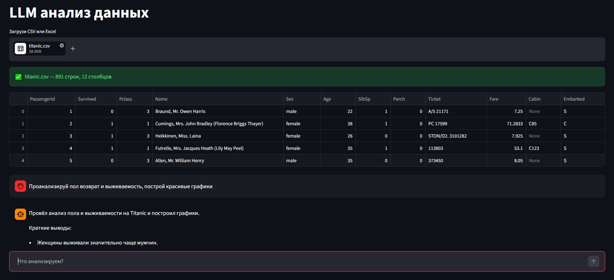
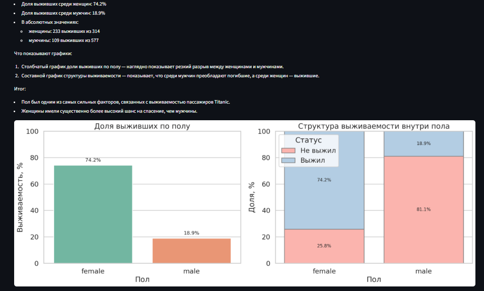
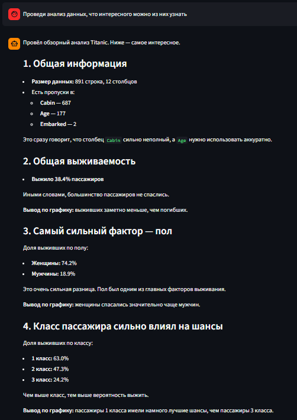
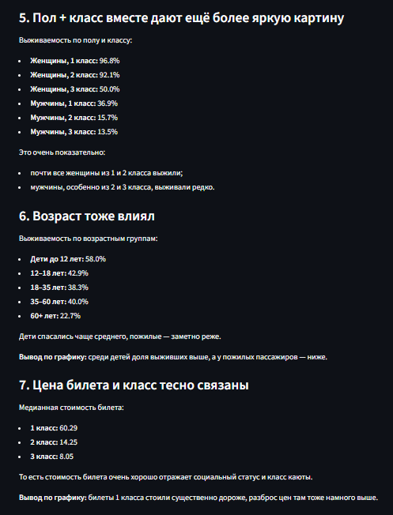
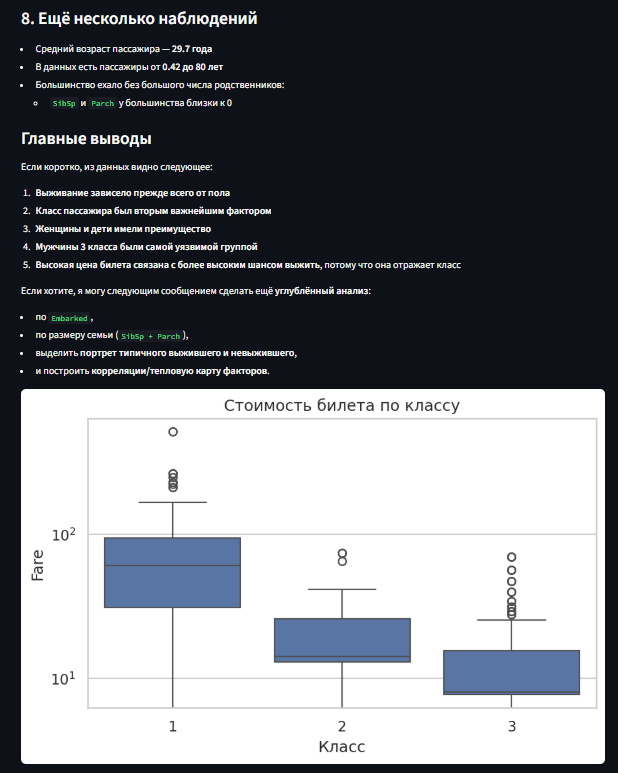
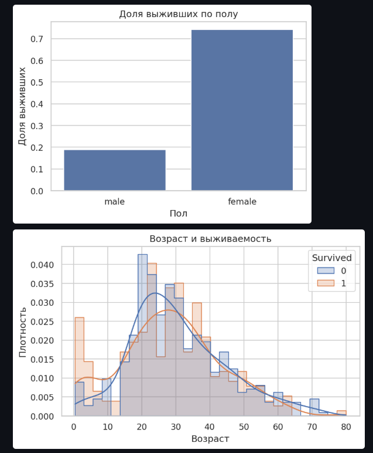
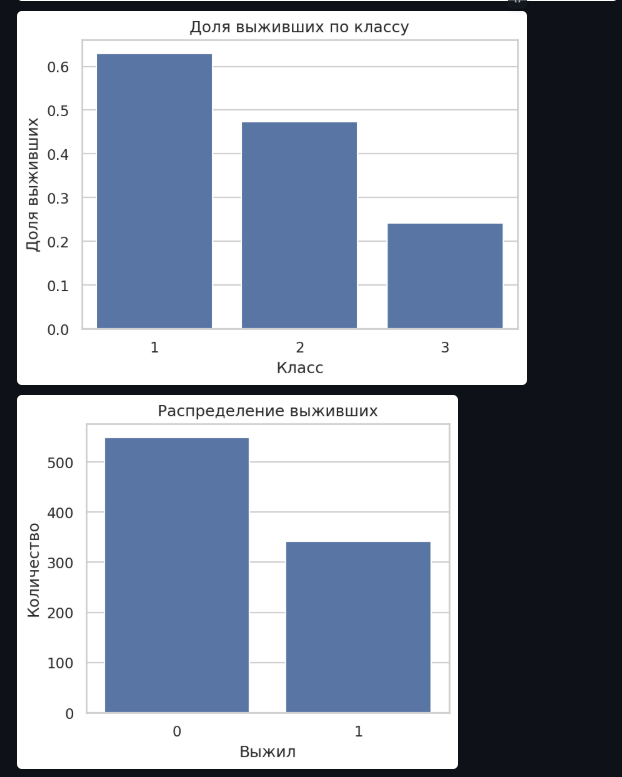

# Лабораторная работа: Мини-продукт с LLM-аналитикой

[Задание](./docs/task.md)

## Возможности

- Отправка файлов csv, excel
- Выполнение кода на python написанного llm
- Построение графиков
- Отправка своих промптов

- Защита от prompt-injection из двух частей
  - Системный промпт с запретов выполнять опасный код, раскрывать системный промпт, токены и прочее
  - Код от llm выполняется в отдельном docker образе

### Пример

Протестировать можно было бы на <http://83.217.202.116/>, но возникла ошибка с приемом файлов и её ещё не получилось исправить. При локальном запуске приём файлов работает

<details open>
  <summary>Скриншоты с демонстрацией работы</summary>

  
  
  
  
  
  
  
</details>

## Установка, настройка и запуск

### Установка

```bash
git clone https://github.com/VL1507/llm-analytics-with-tools.git

cd llm-analytics-with-tools
```

### Настройка

```bash
cp .env.example .env
```

- `API_KEY` можно создать по ссылке [ZvenoAI](https://zveno.ai/api-keys)
- `LLM_MODEL` можно выбрать модель из [списка](https://zveno.ai/models)

При желании можно переопределить еще и `BASE_URL` и взять LLM из другого места

### Запуск

```bash
make up
```

или

```bash
docker build -t sandbox-image ./sandbox
docker compose up --build -d
```

Сайт будет доступен по <http://localhost/>

## Дополнительно

> Зачем мне 3 тайп-чекера?

Экспериментирую, смотрю какой лучше
